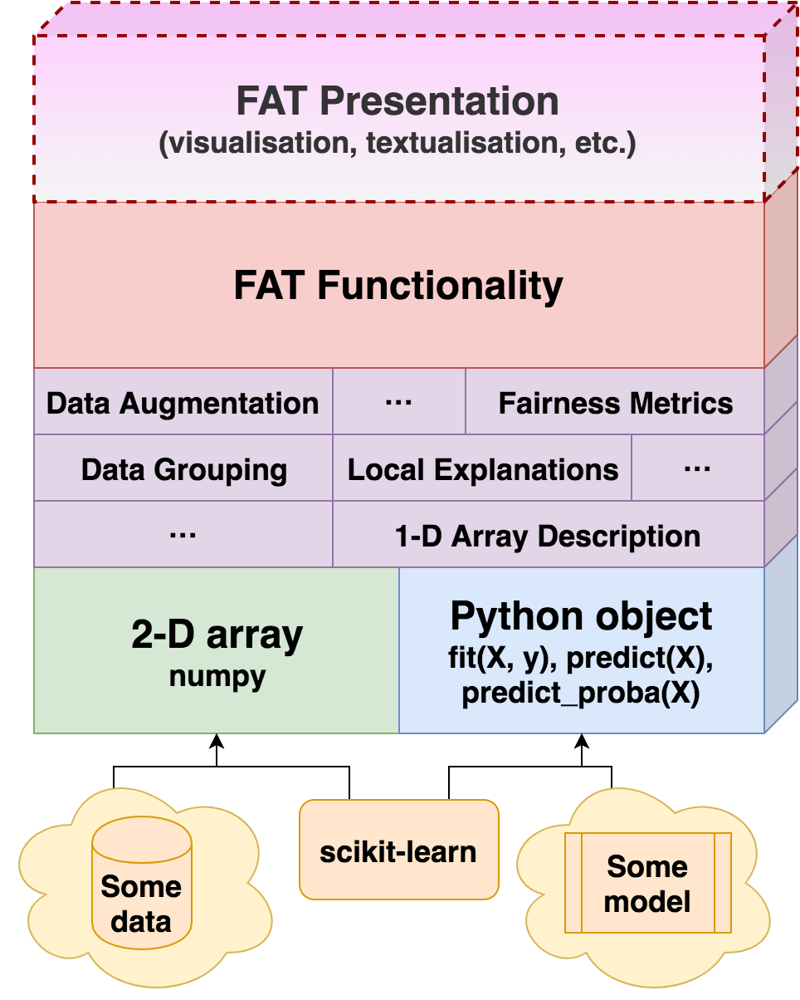

# Background #
Predictive systems, in particular machine learning algorithms, can take
important decisions -- sometimes legally binding -- about our everyday life.
In most cases, however, these systems and decisions are neither regulated nor
certified. Given the potential harm that these systems can cause, qualities
such as **fairness**, **accountability** and **transparency** (FAT) of
predictive systems are of paramount importance. To ensure high-quality, fair,
transparent and reliable predictive systems, we developed an open source Python
package called *FAT Forensics* that can inspect important fairness,
accountability and transparency aspects of these systems to automatically and
objectively report them back to their engineers and users. Our toolbox offers
full functionality for evaluating all aspects of a predictive pipeline: data
(and their features), models and predictions. Published under the BSD 3-Clause
open source licence, FAT Forensics is opened up for personal and commercial
usage.

# Summary #
FAT Forensics is designed as an interoperable framework for *implementing*,
*testing* and *deploying* novel algorithms invented by the FAT research
community and facilitates their evaluation and comparison against the state of
the art, hence democratising access to these techniques. In addition to
supporting research in this space, the toolbox is capable of analysing all
artefacts of a predictive pipeline -- data, models and predictions -- by
considering their fairness, accountability (robustness, security, safety and
privacy) and transparency (interpretability and explainability). FAT Forensics
collates all of these diverse tools and algorithms under a common application
programming interface (API) using a modular design with shared core algorithmic
components, thereby making the process of creating new algorithm as easy as
connecting the right blocks -- see Figure 1.

{width=45%}

The input requirements for data sets and predictive models are kept to a
minimum, lowering any barriers for adoption of FAT Forensics in new and already
well-established projects. In this abstraction a data set is assumed to be a
two-dimensional NumPy array: either a classic or a structured array; with the
latter being a welcome addition given that some of the features may be
categorical (string-based). A predictive model is assumed to be a plain Python
object that has `fit`, `predict` and, optionally, `predict_proba` methods,
making it compatible with the most popular Python machine learning toolbox
scikit-learn without introducing additional dependencies. Moreover, this
approach makes FAT Forensics compatible with other packages for predictive
modelling since their predictive functions can be easily wrapped inside a
Python object with all the required methods.

Our package improves over existing solutions as it collates algorithms across
the FAT domains, taking advantage of their common functional building blocks.
The common interface layer of the toolbox supports several "modes of
operation". The **research mode** (data in -- visualisation out), where the
tool can be loaded into an interactive Python session (e.g., a Jupyter
Notebook), supports prototyping and exploratory analysis. This mode is intended
for FAT researchers who could use it to propose new fairness metrics, compare
them with the existing ones or use them to inspect a new system or a data set.
The **deployment mode** (data in -- data out) can be used as a part of a data
processing pipeline to provide a (numerical) FAT analytics, supporting
automated reporting and dashboarding. This mode is intended for machine
learning engineers and data scientists who may use it to monitor or evaluate a
predictive system during development and deployment.

To encourage long-term maintainability, sustainability and extensibility, FAT
Forensics has been developed employing software engineering best practice such
as unit testing, continuous integration, well-defined package structure and
consistent code formatting. Furthermore, our toolbox is supported by a thorough
and beginner-friendly documentation that is based on 4 main pillars, which
together build up the user's confidence in using the package:

* narrative-driven **tutorials** designated for new users, which will guide
  them step-by-step through practical use cases of all the main aspects of the
  package;
* **how-to guides** created for relatively new users of the package, which will
  showcase the flexibility of the package and show how to use it to solve
  user-specific FAT challenges, e.g., how to build your own local surrogate
  model explainer by pairing a data generator and a local glass-box model;
* an **API documentation** describing functional aspects of the algorithms
  implemented in the package and designated for a technical audience as a
  reference material complemented by task-focused *code examples* that put the
  functions, objects and methods in a context; and
* a **user guide** discussing theoretical aspects of the algorithms implemented
  in the package such as their restrictions, caveats, computational time and
  memory complexity, among others.

We hope that this effort will encourage the FAT community to contribute their
algorithms to FAT Forensics as an attractive alternative to releasing yet more
standalone packages, keeping the toolbox at the frontiers of algorithmic
fairness, accountability and transparency research. For a more detailed
description of FAT Forensics, we point the reader to its documentation and the
manuscript [@sokol2019fatf] describing its design, scope and usage examples.

# Acknowledgements #

This work was financially supported by Thales, and is the result of a
collaborative research agreement between Thales and the University of Bristol.

# References #
